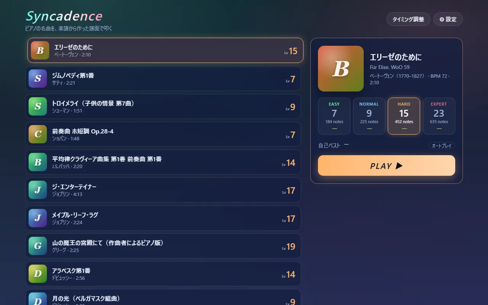
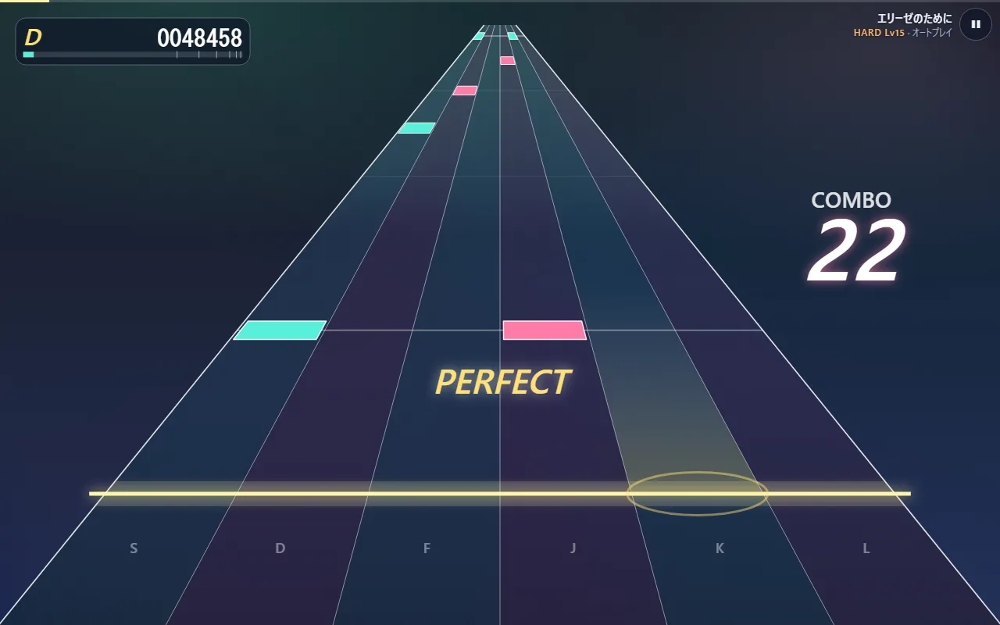
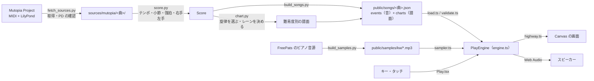

# 全体像 — 何をするプログラムで、どのファイルがどこを担うか

## 何をするプログラムか

ピアノの名曲を、楽譜から自動で作った譜面で叩くリズムゲームです。ブラウザで動き、パソコンではキーボード、スマホでは画面のタッチで遊べます。

作りは大きく 2 つに分かれます。

1. **譜面を作る（Python・事前に 1 回）** — Mutopia Project で公開されているパブリックドメインの楽譜（MIDI と LilyPond）を読み、難易度ごとの譜面と、鳴らす音の一覧を JSON に書き出します（`tools/`）。
2. **遊ぶ（TypeScript・ブラウザの中）** — JSON を読み込み、ピアノの音を鳴らしながらノーツを流し、押した時刻を判定します（`src/`）。

譜面と音は**同じ楽譜から同じ時間軸で**作られます。ノーツ 1 つ 1 つが「この音を鳴らす」という対応（`links`）を持っているので、叩いたノーツと鳴っている音が作りの上でずれません。

## データの流れ

## どのファイルが何を担うか

### 画面（`src/ui`）

| ファイル | 役目 |
|---|---|
| [main.tsx](../code/src-main.tsx.html) | 入口。React に `App` と `RotateHint` を描かせる |
| [App.tsx](../code/src-ui-App.tsx.html) | いまどの画面か（選曲・プレイ・結果・タイミング調整）を持ち、切り替える |
| [landscape.ts](../code/src-ui-landscape.ts.html) / [RotateHint.tsx](../code/src-ui-RotateHint.tsx.html) | スマホでは、タップで全画面に入って横向きに固定し、縦に持っている間は「横向きにしてください」を重ねる |
| [SongSelect.tsx](../code/src-ui-SongSelect.tsx.html) / [select.ts](../code/src-ui-select.ts.html) | 選曲画面。矢印キーで曲と難易度を動かす |
| [Play.tsx](../code/src-ui-Play.tsx.html) | プレイ画面。曲を読み込み、毎フレームの進行と描画を回し、キーとタッチを `PlayEngine` に渡す |
| [Result.tsx](../code/src-ui-Result.tsx.html) | 結果画面。スコア・ランク・判定の内訳・押した時刻のずれ |
| [Calibrate.tsx](../code/src-ui-Calibrate.tsx.html) | タイミング調整。クリック音に合わせて叩いてもらい、端末の遅れを測る |
| [SettingsPanel.tsx](../code/src-ui-SettingsPanel.tsx.html) | 設定の項目（流れる速さ・補正・音量・再生速度など） |

### 進行と判定（`src/game`）

| ファイル | 役目 |
|---|---|
| [engine.ts](../code/src-game-engine.ts.html) | 1 回のプレイの司令塔 `PlayEngine`。開始・一時停止・押下・毎フレームの進行をまとめる |
| [session.ts](../code/src-game-session.ts.html) | どのノーツが判定済みか、コンボ、スコアを持つ `GameSession` |
| [judge.ts](../code/src-game-judge.ts.html) | 判定の幅（PERFECT ±42 ms など）とスコアの重み |
| [keys.ts](../code/src-game-keys.ts.html) | キーとレーンの対応（4 レーンは D F J K） |
| [rank.ts](../code/src-game-rank.ts.html) / [stats.ts](../code/src-game-stats.ts.html) | ランクの境目、ずれの平均や中央値 |

### 音と時計（`src/audio`）

| ファイル | 役目 |
|---|---|
| [context.ts](../code/src-audio-context.ts.html) | 音を鳴らす土台 `AudioContext` を 1 つだけ作る |
| [clock.ts](../code/src-audio-clock.ts.html) | 「いまスピーカーから聞こえている曲の位置」を出す `SongClock` |
| [scheduler.ts](../code/src-audio-scheduler.ts.html) | 曲の音を 0.4 秒先まで少しずつ予約していく |
| [sampler.ts](../code/src-audio-sampler.ts.html) / [regions.ts](../code/src-audio-regions.ts.html) | ピアノの録音を読み込み、音の高さと強さに合わせて鳴らす |

### 描画（`src/render`）と曲データ（`src/song`）

| ファイル | 役目 |
|---|---|
| [perspective.ts](../code/src-render-perspective.ts.html) | 奥へ細くなるレーンの座標。時刻を「奥行き」に写す |
| [highway.ts](../code/src-render-highway.ts.html) | 1 フレーム分の絵（レーン・ノーツ・判定の文字・スコア）を Canvas に描く |
| [types.ts](../code/src-song-types.ts.html) / [load.ts](../code/src-song-load.ts.html) / [validate.ts](../code/src-song-validate.ts.html) | 曲データの形、読み込み、壊れていないかの確認 |
| [storage.ts](../code/src-storage.ts.html) | 設定と自己ベストをブラウザに保存する |

### 譜面を作る（`tools`・Python）

| ファイル | 役目 |
|---|---|
| [fetch_sources.py](../code/tools-fetch_sources.py.html) | 楽譜を取得し、ヘッダに「Public Domain」と書かれていない曲は止める |
| [score.py](../code/tools-score.py.html) | MIDI を読み、テンポ・小節線・拍の強さ・右手左手を出す |
| [chart.py](../code/tools-chart.py.html) | 楽譜から難易度別の譜面を作る。このゲームのいちばんの工夫 |
| [build_songs.py](../code/tools-build_songs.py.html) | 曲ごとの JSON と一覧 `index.json` を書き出す |
| [build_samples.py](../code/tools-build_samples.py.html) | ピアノ音源をブラウザ向けの mp3 に変換する |

## 読む順序

1. まず `notes/02-from-score` と `notes/03-one-note` で、譜面ができるまでと、ノーツ 1 つが判定されるまでの筋をつかみます。
2. 次にコードを、プレイの流れに沿って読みます。
   - 画面の入口: `main.tsx` → `App.tsx` → `landscape.ts` → `RotateHint.tsx` → `storage.ts`
   - 曲を読む: `song/types.ts` → `song/load.ts` → `song/validate.ts` → `SongSelect.tsx` → `select.ts`
   - プレイ: `Play.tsx` → `engine.ts` → `keys.ts` → `session.ts` → `judge.ts`
   - 音と時計: `context.ts` → `clock.ts` → `scheduler.ts` → `sampler.ts` → `regions.ts`
   - 描画: `perspective.ts` → `highway.ts`
   - 終わったあと: `Result.tsx` → `rank.ts` → `stats.ts` → `Calibrate.tsx` → `SettingsPanel.tsx`
   - 譜面作り: `fetch_sources.py` → `score.py` → `chart.py` → `build_songs.py` → `build_samples.py`
3. 知らない書き方が出てきたら `notes/05-syntax` で引きます。最初に説明したファイルへ飛べます。
4. 「この数字を変えるとどうなるか」は `notes/06-knobs` にまとめてあります。

## 写したファイルと、写していないもの

このキットはコミット `404da56` の 32 ファイルを丸ごと写しています。プレイの筋に関わらないものは外しました。

- `src/ui/format.ts`（秒を「2:10」の形にするなどの小さな整形）と `src/ui/SettingsDrawer.tsx`（選曲画面の右から出す枠。中に `SettingsPanel.tsx` と遊び方の説明を入れる）。
- `tools/inspect_chart.py`（作った譜面を確かめるための道具）。
- テスト（`src/**/*.test.ts`、`tools/tests/`）、見た目の CSS（`src/styles/`）、曲データの JSON そのもの。
