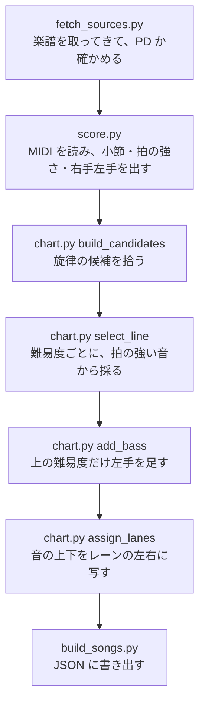

# 楽譜のファイルが、ゲームが読む譜面になるまで（Python）

`tools/` の 5 本は、ゲームを遊ぶ前に 1 回だけ動かす下ごしらえです。最後に `public/songs/<曲>.json` ができ、ブラウザはそれを読むだけです。

## 1. 楽譜を取ってくる — `fetch_sources.py`

曲の一覧 `tools/songs.json` に書いた 12 曲について、Mutopia Project から MIDI と LilyPond のソース（`.ly`）を取ってきます。取得先は `https://www.mutopiaproject.org/ftp/` に固定してあり（[L24](../code/tools-fetch_sources.py.html#L24)）、`.ly` のヘッダに `license = "Public Domain"` か `copyright = "Public Domain"` が無い曲はそこで止めます（[L28](../code/tools-fetch_sources.py.html#L28)）。

録音ではなく楽譜を使うのは、権利の確認を楽譜の版だけで済ませるためです。演奏の録音には演奏した人の権利が付きますが、楽譜から鳴らす音にはそれがありません。

## 2. 楽譜を読む — `score.py`

MIDI は「何 tick 目に、どの高さの音を、どの強さで押した・離した」という出来事の列です。`load_score`（[L168](../code/tools-score.py.html#L168)）がこれを 1 音ずつの `Note` にまとめ、次の情報を足します。

| 情報 | どう決めるか |
|---|---|
| 秒 | テンポの変化をたどって tick を秒に直す（`TempoMap`） |
| 小節線 | 拍子記号から。曲が小節の途中から始まる（弱起）ときは、`.ly` の `\partial` から長さを読んでずらす |
| 拍の強さ（拍節レベル） | 0 = 小節の頭、1 = 拍の頭、2 = 半拍、3 = さらに半分、4 = それ以外（[L110](../code/tools-score.py.html#L110)） |
| 右手か左手か | MIDI のトラックごとの平均の高さで、高い方の半分を右手にする（[L202-204](../code/tools-score.py.html#L202)） |
| 鳴っている長さ | ダンパーペダルを踏んでいる間は音を延ばす。鳴らす音にだけ使い、ロングノーツの判定には使わない |

拍の強さが、このあと難易度を作るときの物差しになります。

## 3. 旋律の候補を拾う — `build_candidates`

ピアノの曲は同時にいくつも音が鳴るので、全部をノーツにすると叩けません。`build_candidates`（[chart.py L86](../code/tools-chart.py.html#L86)）は、同じ時刻に鳴る音のまとまりから 1 つを代表に選びます。

- 右手は、いちばん高い音を旋律とみなします。ただし、それより高い音が前から鳴り続けているときは内側の声部なので外します（`_is_inner_voice`、[L115](../code/tools-chart.py.html#L115)）。
- 左手は、いちばん低い音をベースとみなします。
- 70 ms より短く、拍の格子から外れた右手の音は装飾音とみなして外します（[L106](../code/tools-chart.py.html#L106)）。

代表に選ばなかった音も、`links` として候補に持たせます。叩いたときに和音ごと鳴らせるようにするためです。

## 4. 難易度ごとに採る — `select_line`

小節ごとに「難易度の上限に収まる範囲で、いちばん細かい拍の強さまで」旋律の音を採ります（[L137](../code/tools-chart.py.html#L137)）。上限は `DIFFICULTIES`（[L39-44](../code/tools-chart.py.html#L39)）の「採る最大レベル」と「1 秒あたりのノーツ数」です。

『エリーゼのために』の最初の小節（0.417〜1.667 秒、8 分の 3 拍子）で見てみます。旋律の候補は 6 つあります。

| 時刻（秒） | 音 | 拍の強さ | EASY | NORMAL | HARD | EXPERT |
|---|---|---|---|---|---|---|
| 0.417 | ミ | 0（小節の頭） | ○ | ○ | ○ | ○ |
| 0.625 | レ♯ | 2（半拍） |  |  |  | ○ |
| 0.833 | ミ | 1（拍の頭） |  | ○ | ○ | ○ |
| 1.042 | シ | 2 |  |  |  | ○ |
| 1.250 | レ | 1 |  | ○ | ○ | ○ |
| 1.458 | ド | 2 |  |  |  | ○ |

EASY の上限は「レベル 1 まで、1 秒に 1.8 個まで」です。レベル 1 までを採ると 3 個 ÷ 1.25 秒 = 2.4 個/秒で上限を超えるので、1 段粗いレベル 0 に落とし、小節の頭の 1 個だけを採ります。NORMAL は上限 3.0 個/秒なので、レベル 2 までの 6 個（4.8 個/秒）は超え、レベル 1 までの 3 個（2.4 個/秒）で収まります。

HARD の上限は 4.8 個/秒で、6 個 ÷ 1.25 秒はちょうど 4.8 です。それでも 3 個になるのは、MIDI のテンポが 4 分音符 1 つ 0.833333 秒（マイクロ秒単位）で記録されていて、この小節の長さが 1.2499995 秒になるためです。6 ÷ 1.2499995 = 4.8000019 個/秒がわずかに上限を超え、1 段粗いレベル 1 に落ちます。EXPERT は上限 7.5 個/秒なので、6 個すべてを採ります。

拍の頭から順に採るので、どの難易度でも**叩く位置が拍の格子からはみ出しません**。間引いても曲のリズムの骨格が残るのはこのためです。

採ったあとに 2 つ整えます。

- 前のノーツと最小間隔より近いものは、拍の強い方だけを残します（`_enforce_gap`、[L156](../code/tools-chart.py.html#L156)）。
- 長い空白は、採らなかった旋律の音で埋めます（`_fill_gaps`、[L172](../code/tools-chart.py.html#L172)）。遅い曲で EASY がすかすかにならないようにするためです。

## 5. 左手を足す — `add_bass`

HARD と EXPERT だけ、強い拍の左手の音を足します（[L205](../code/tools-chart.py.html#L205)）。旋律と同時に鳴るものは 2 本同時押しにし、旋律の無い拍には左手だけのノーツを置きます。

## 6. レーンを決める — `assign_lanes`

レーンは音の高さに合わせます（[L226](../code/tools-chart.py.html#L226)）。

1. 前後 3 秒の旋律の音域の中で、その音がどのくらい高いかで基準のレーンを決めます（`_contour_lane`、[L276](../code/tools-chart.py.html#L276)）。
2. 直前の音より高ければ右へ、低ければ左へ動かします。同じ音の繰り返しは同じレーンです（`_apply_motion`、[L286](../code/tools-chart.py.html#L286)）。
3. そのレーンが前のノーツ（ロングノーツの途中を含む）でふさがっていれば、近い空きレーンを探します（`_free_lane`、[L310](../code/tools-chart.py.html#L310)）。

こうすると、旋律が上がっていく所では指が右へ、下がる所では左へ流れます。耳で聞いた動きと手の動きが一致するのが狙いです。

一定以上長く続く音は、ロングノーツ（押しっぱなしにするノーツ）になります（`_hold_duration`、[L266](../code/tools-chart.py.html#L266)）。

## 7. 書き出す — `build_songs.py`

1 曲を 1 つの JSON にまとめます（`song_payload`、[L29](../code/tools-build_songs.py.html#L29)）。中身は大きく 2 つです。

- `events` — 鳴らす音すべて。`[開始秒, 音の高さ, 長さ秒, 強さ, 右手0/左手1]`
- `charts` — 難易度ごとの譜面。ノーツ 1 つが `[時刻秒, レーン, ロングの長さ秒, 鳴らす音の番号の列]`

ノーツの最後の要素が `events` の番号を指しているので、ノーツと音は同じものから作られています。『エリーゼのために』では `events` が 905 音、ノーツは EASY 184・NORMAL 225・HARD 452・EXPERT 635 個です。

難易度の数字（レベル）は、2 秒ごとの密度の上位 1 割あたりの値 p90 から `round(1 + p90 × 3.2)` で出します（`chart_level`、[chart.py L330](../code/tools-chart.py.html#L330)）。

## 8. ピアノの音 — `build_samples.py`

鳴らす音は、FreePats の Upright Piano KW（CC0）の録音です。`build_samples.py` が元の flac をブラウザで扱いやすい mp3 に変換し、どの鍵盤の範囲にどの録音を使うかを `manifest.json` に書きます。ブラウザ側の `sampler.ts` は、この表を見て、鳴らす音の高さを受け持つ録音を、強さに応じて弱い打鍵・強い打鍵の 2 種類から選びます。録音の基準の高さとの差は、再生速度を `2 ** (半音の差 / 12)` 倍にして合わせます（[sampler.ts L53](../code/src-audio-sampler.ts.html#L53)）。
