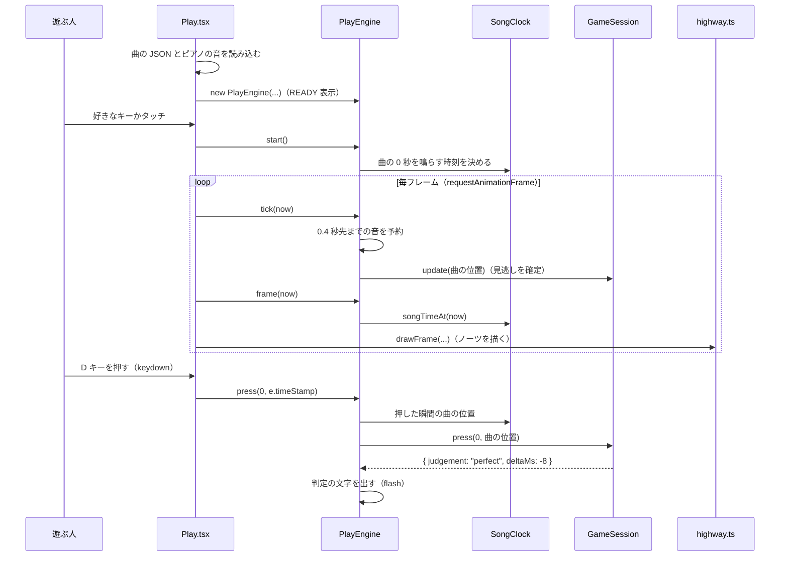
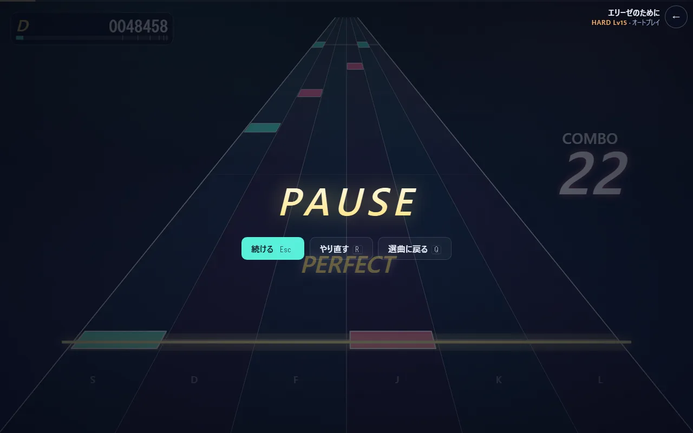

# ノーツ 1 つが流れてきて、叩いて、判定が出るまで（TypeScript）

PLAY を押してから、1 つのノーツに「PERFECT」が出るまでを、呼ばれる順にたどります。

## 登場するもの

| もの | ファイル | 一言で |
|---|---|---|
| `Play` | [Play.tsx](../code/src-ui-Play.tsx.html) | プレイ画面。React の部品で、読み込み・毎フレームのループ・入力の受け付けを持つ |
| `PlayEngine` | [engine.ts](../code/src-game-engine.ts.html) | 1 回のプレイの司令塔。時計・音の予約・判定をまとめて動かす |
| `SongClock` | [clock.ts](../code/src-audio-clock.ts.html) | 「いま聞こえている曲の位置（秒）」を答える |
| `EventScheduler` | [scheduler.ts](../code/src-audio-scheduler.ts.html) | 曲の音を少し先まで予約していく |
| `GameSession` | [session.ts](../code/src-game-session.ts.html) | ノーツごとの状態（まだ・押している途中・済み）とコンボ・スコア |
| `drawFrame` | [highway.ts](../code/src-render-highway.ts.html) | 1 フレームの絵を描く |

## 全体の流れ



## 1. 読み込んで、READY で待つ

`Play` が画面に出ると、最初の `useEffect`（[Play.tsx L44-67](../code/src-ui-Play.tsx.html#L44)）が曲の JSON を読み込み、その曲で使うピアノの録音をすべて読み込んでから `PlayEngine` を作ります。

`PlayEngine` のコンストラクタ（[engine.ts L49-69](../code/src-game-engine.ts.html#L49)）がすることは、

- 選んだ難易度の譜面から `GameSession` を作る
- 音量のつまみ（`GainNode`）を 1 つ作り、スピーカーにつなぐ
- `EventScheduler` に曲の音の一覧を渡す
- 曲を終える時刻を「最後のノーツ + 2.5 秒」と「曲の長さ」の短い方に決める

この時点では音も時間も動いていません。画面には READY と出ています。

## 2. キーを押して始める

READY の間に押されたキーは、判定ではなく開始の合図になります（[Play.tsx L116-121](../code/src-ui-Play.tsx.html#L116)）。F11 や Tab のようにブラウザの操作に使うキーは合図にしません（[keys.ts](../code/src-game-keys.ts.html) の `isStartKey`）。

`start()`（[engine.ts L80-90](../code/src-game-engine.ts.html#L80)）は、**曲の 0 秒をスピーカーから鳴らす `AudioContext` の時刻**を 1 つ決めて `SongClock` に渡します。最初のノーツが奥から判定線まで流れてくる時間（既定 1.6 秒）と、さらに 0.8 秒の間を空けて始まるよう、0 秒より前から時計を動かし始めます。

## 3. 毎フレーム進める

`requestAnimationFrame` で画面の書き換えごと（たいてい 1 秒に 60 回）に `loop` が呼ばれます（[Play.tsx L78-98](../code/src-ui-Play.tsx.html#L78)）。

`tick(now)`（[engine.ts L178-192](../code/src-game-engine.ts.html#L178)）が 1 フレーム分の仕事をします。

1. `SongClock` に今の時刻を教え、時計のずれを直す（→ `notes/04-timing`）。
2. `EventScheduler.pump` で、`AudioContext` の今の時刻から 0.4 秒先までの音を予約する。予約した音は、ブラウザが決まった時刻ぴったりに鳴らします。
3. `GameSession.update` で、判定の幅（GOOD の 125 ms）を過ぎても押されなかったノーツを MISS にする。
4. すべてのノーツが判定済みで、曲の終わりの時刻を過ぎたら `true` を返す。`Play` はそれを見て結果画面へ移ります。

続いて `frame(now)`（[engine.ts L194-215](../code/src-game-engine.ts.html#L194)）が「いま描くべき曲の位置」などを 1 つの値にまとめ、`drawFrame` が描きます。

## 4. ノーツが奥から流れてくる

あるノーツが画面のどこに描かれるかは、**そのノーツの時刻と、いま聞こえている曲の位置の差**だけで決まります（[highway.ts L163](../code/src-render-highway.ts.html#L163)）。

```
u = (ノーツの時刻 − 曲の位置) ÷ (流れてくる時間 × 再生速度)
```

`u = 1` が奥の端、`u = 0` が判定線です。`u` を [perspective.ts](../code/src-render-perspective.ts.html) の `depthOf` で「奥行き」に写すと、奥ではゆっくり、手前ほど速く動いて見えます。ノーツの位置を毎フレーム少しずつ動かしているのではなく、毎フレーム時刻から計算し直しているので、フレームが飛んでもノーツの位置は狂いません。

## 5. 押した瞬間の時刻で判定する

D キーを押すと `keydown` が届き、`engine.press(0, e.timeStamp)` が呼ばれます（[Play.tsx L134-137](../code/src-ui-Play.tsx.html#L134)）。スマホでは、画面のどの横位置を叩いたかからレーンを出します（`laneAt`）。

ここで渡すのは、処理が動いた時刻ではなく `e.timeStamp`（**キーが押された瞬間の時刻**）です。描画で忙しくて処理が数 ms 遅れても、押した瞬間で判定できます。

`press`（[engine.ts L145-151](../code/src-game-engine.ts.html#L145)）は、その時刻を `judgeTime` で「曲の何秒目か」に直し、入力の補正を引いてから `GameSession.press` に渡します。

`GameSession.press`（[session.ts L90-111](../code/src-game-session.ts.html#L90)）は、

1. そのレーンでまだ判定されていない最初のノーツを探す
2. ノーツの時刻との差を実時間のミリ秒にする（再生速度を落としているときは速度で割る）
3. `judgeDelta`（[judge.ts L20](../code/src-game-judge.ts.html#L20)）で判定を決める

| 差（±） | 判定 | スコアの重み |
|---|---|---|
| 42 ms 以内 | PERFECT | 1 |
| 83 ms 以内 | GREAT | 0.75 |
| 125 ms 以内 | GOOD | 0.35 |
| 160 ms 以内 | MISS | 0 |
| それより外 | 何もしない（空振り） | — |

160 ms より早い空振りを無視するのは、早く押しすぎただけで次のノーツを消費しないためです。

4. 判定を数え、コンボを伸ばす（MISS なら 0 に戻す）。ロングノーツなら「押している途中」にする。

## 6. 判定が画面に出る

`press` が返した結果は `handle`（[engine.ts L127-139](../code/src-game-engine.ts.html#L127)）で「判定の文字を出す」記録（flash）になり、次のフレームから `drawFrame` が判定線の上に PERFECT などの文字と光を描きます。スコアは `重みの合計 ÷ 判定の数の合計 × 1,000,000` で、毎フレーム計算し直して左上に出します。

## 7. ロングノーツと一時停止

- **ロングノーツ**は始点と終点で 2 回数えます。終点の 150 ms 手前より後に離せば成功、それより早く離すと終点は MISS です（[session.ts L114-121](../code/src-game-session.ts.html#L114)）。押し続けたまま終点を過ぎれば、`update` が成功として確定させます。
- **一時停止**（Esc か画面の ❚❚ ボタン）では、`AudioContext` そのものを止めます（`ctx.suspend()`）。予約済みの音も、曲の時計も一緒に止まります。描画は止めた瞬間の時刻で固定するので、ノーツも動きません（[engine.ts L92-109](../code/src-game-engine.ts.html#L92)、[L195](../code/src-game-engine.ts.html#L195)）。タブを切り替えたときやウィンドウから離れたときも、自動で一時停止します。


