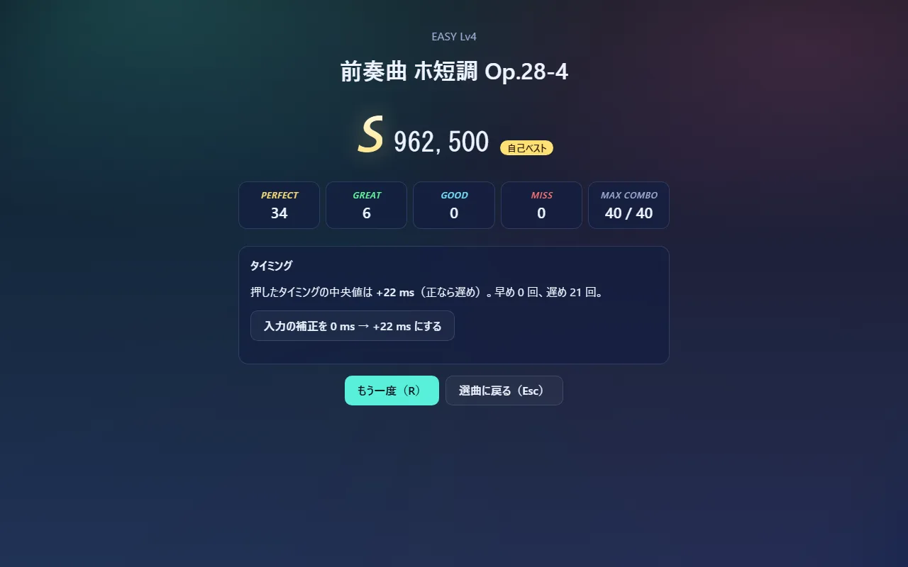

# 音と画面と入力の時刻をそろえる仕組み

リズムゲームでいちばん難しいのは、**聞こえている音・見えているノーツ・押した瞬間**の 3 つを同じ時間軸に載せることです。ブラウザの中には時計が 2 種類あり、しかも音はスピーカーから出るまでに遅れます。このゲームはそれを次のように扱います。

## ブラウザにある 2 つの時計

| 時計 | 何の時刻か | 使う所 |
|---|---|---|
| `AudioContext.currentTime`（秒） | 音を作る仕組み（Web Audio）の時刻。音の予約はすべてこの時刻で書く | 音を鳴らす |
| `performance.now()`（ミリ秒） | ページを開いてからの経過時間。キーを押した時刻 `e.timeStamp` も、画面を書き換える時刻もこの時計 | 描画・判定 |

2 つは別々に進むので、そのままでは「キーを押した瞬間に、曲の何秒目が聞こえていたか」が分かりません。

## 基準は音の時計 1 つ

このゲームは、**曲の時刻はすべて音の時計から決める**と決めています。開始のときに「曲の 0 秒を鳴らす `AudioContext` の時刻」を 1 つ決め（[engine.ts L89](../code/src-game-engine.ts.html#L89)）、各音はそこからの相対時刻で予約します（`contextTimeOf`、[clock.ts L65](../code/src-audio-clock.ts.html#L65)）。

```
音を鳴らす時刻 = 曲の 0 秒の時刻 + 楽譜上の時刻 ÷ 再生速度
```

予約は毎フレーム、音の時計の今から 0.4 秒先までだけ行います（[scheduler.ts L17-30](../code/src-audio-scheduler.ts.html#L17)）。1 曲分を一度に予約すると、一時停止や途中でやめたときに取り消すのが大変になるうえ、ブラウザが抱える音の数も増えるためです。予約した音はブラウザが時刻どおりに鳴らすので、画面の処理が重くなっても音のリズムは崩れません。

## 「いま聞こえている位置」を出す — `SongClock`

音の時計の「今」は、音を**作っている**時刻です。スピーカーから**聞こえる**のはそれより少し後です（Bluetooth のイヤホンなら 100 ms を超えることもあります）。ノーツを判定線に届かせたいのは、聞こえるタイミングです。

`SongClock` の `sampleOffset`（[clock.ts L15-28](../code/src-audio-clock.ts.html#L15)）は、「聞こえている音の時計の時刻 − `performance.now()`」の差を求めます。

1. ブラウザが `getOutputTimestamp()` を持っていれば、「この `performance.now()` の瞬間に、音の時計のこの時刻がスピーカーから出ていた」という組を教えてくれるので、その差を使います。
2. その値が音の時計の今から 0.5 秒以上離れていれば壊れているとみなし、`currentTime − baseLatency − outputLatency`（ブラウザが申告する遅れを引いた値）で代わりにします。古い Safari では 1. の値がおかしいことが知られているためです。

ブラウザごとにどの値が信用できるかは、調べた結果を [docs/research/03-web-audio-timing.md](https://github.com/takumayellow/syncadence-v2/blob/main/docs/research/03-web-audio-timing.md) にまとめています。

差が分かれば、`performance.now()` のどの時刻でも曲の位置に直せます（`songTimeAt`、[clock.ts L58-62](../code/src-audio-clock.ts.html#L58)）。

```
曲の位置 = (performance.now()/1000 + 差 − 曲の 0 秒の時刻) × 再生速度
```

この差は毎フレーム測り直しますが、測るたびに数 ms 揺れます。そのまま使うとノーツが小刻みに震えるので、新しい値に 5% ずつ寄せてならします（[L49](../code/src-audio-clock.ts.html#L49)）。ただし 25 ms を超えて変わったときは、音が途切れたなどで本当にずれたとみなし、すぐ新しい値に切り替えます（[L46-47](../code/src-audio-clock.ts.html#L46)）。

## 3 つをこの時計でつなぐ

| 何を | どの時刻で | どこ |
|---|---|---|
| 音を鳴らす | 曲の 0 秒の時刻 + 楽譜の時刻 | `EventScheduler` → `contextTimeOf` |
| ノーツを描く | 描くときの `performance.now()` を曲の位置に直し、表示の補正を引く | `engine.frame` |
| 判定する | キーが押された瞬間の `e.timeStamp` を曲の位置に直し、入力の補正を引く | `engine.judgeTime` |

判定に `e.timeStamp` を使うのは、描画で忙しくて処理が遅れても、押した瞬間で判定できるからです。端末によってはこの値が壊れていることがあるので、0 や未来の値、1 秒以上前の値は今の時刻で代用します（`eventTimeMs`、[engine.ts L19-21](../code/src-game-engine.ts.html#L19)）。

## それでも残るずれは、遊ぶ人が補正する

ブラウザが申告しない遅れ（OS の音の処理、一部の Bluetooth）と、押す人の癖は、コードからは分かりません。そこで 2 つの補正を設定に置いています。

| 設定 | 効き方 |
|---|---|
| 入力の補正 | 判定に使う時刻から引く。正の値にすると、遅めに押しても合う |
| 表示の補正 | 描画に使う時刻から引く。正の値にすると、ノーツが遅れて判定線に届く |

値を決める方法も 2 つ用意しています。

- **タイミング調整の画面**（[Calibrate.tsx](../code/src-ui-Calibrate.tsx.html)）— 0.6 秒おきのクリック音を 20 回鳴らし、合わせて叩いてもらいます。最初の 4 回は耳慣らしとして数えず、残りの「叩いた時刻 − クリックの時刻」の中央値を入力の補正にします（[stats.ts L29-39](../code/src-game-stats.ts.html#L29)）。平均ではなく中央値なのは、1 回だけ大きく外した叩きに引きずられないためです。
- **結果画面の提案**（[Result.tsx](../code/src-ui-Result.tsx.html)）— 20 回以上叩いて、ずれの中央値が 12 ms 以上あれば、補正をその分動かすボタンを出します。



## 一時停止で時計を止める

一時停止では `AudioContext` そのものを止めます（`ctx.suspend()`）。音の時計が止まるので、予約済みの音も鳴らず、曲の位置も進みません。再開（`ctx.resume()`）すると、音の時計は止めた時刻の続きから進むので、曲も止めた位置から続きます。ただし `performance.now()` との差は止めていた時間の分だけ変わるので、`SongClock` は覚えていた差を捨てて測り直します（`reset`、[engine.ts L102](../code/src-game-engine.ts.html#L102)）。

ただし `performance.now()` は止まっている間も進みます。描画にそれをそのまま使うと、止まっているはずのノーツが動いて見えます。そこで止めた瞬間の `performance.now()` を覚えておき、止まっている間はその時刻で描きます（[engine.ts L95](../code/src-game-engine.ts.html#L95)、[L195](../code/src-game-engine.ts.html#L195)）。
