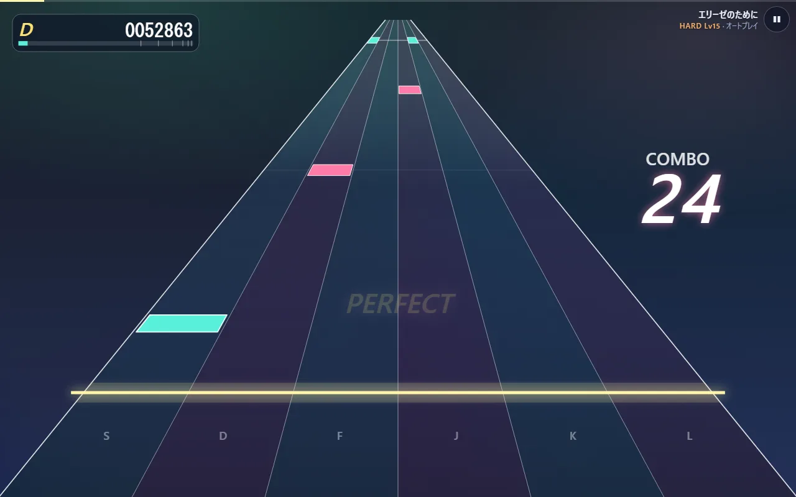
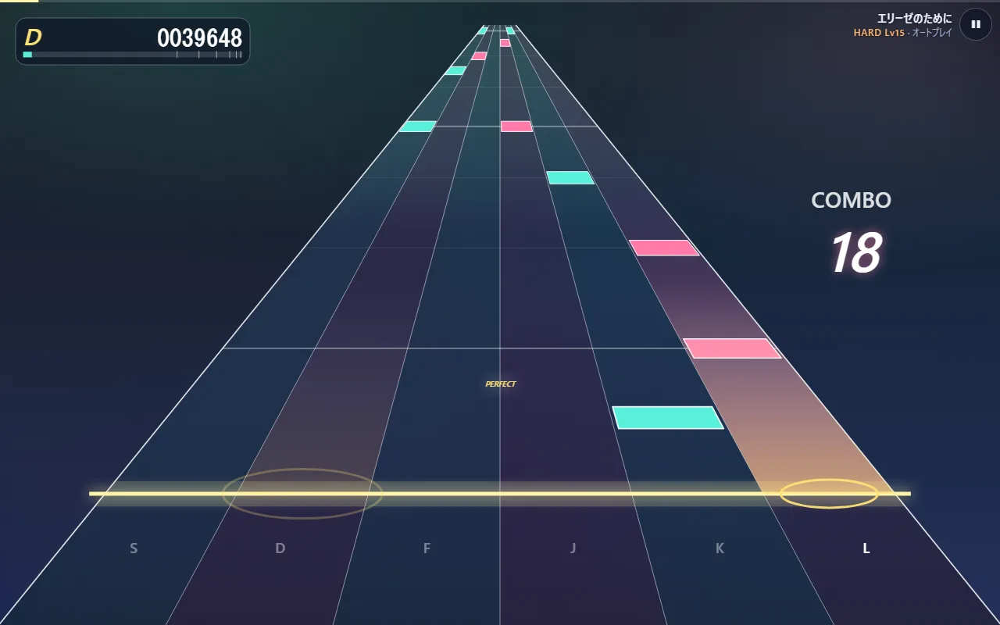

# 難易度・判定の幅・見た目を決めている数値

ゲームの手触りは、コードのあちこちに置いた数値で決まっています。ここでは「どこにあって、変えると何が起きるか」を一覧にします。どれも名前の付いた定数なので、1 か所を書き換えれば全体に効きます。

## 遊ぶ人が設定で変えられるもの

既定値は [storage.ts L18-24](../code/src-storage.ts.html#L18)、範囲は [L39-45](../code/src-storage.ts.html#L39) です。範囲の外の値が保存されていても、読み込むときにこの範囲へ戻します。

| 設定 | 既定 | 範囲 | 変えると |
|---|---|---|---|
| ノーツが流れてくる時間 `approachSeconds` | 1.6 秒 | 0.6〜4 秒 | 小さいほどノーツが速く流れ、画面に同時に見えるノーツが減る |
| 入力の補正 `inputOffsetMs` | 0 ms | ±300 ms | 判定に使う時刻から引く（→ `notes/04-timing`） |
| 表示の補正 `visualOffsetMs` | 0 ms | ±300 ms | 描画に使う時刻から引く |
| 音量 `volume` | 0.8 | 0〜1 | 全体の音の大きさ |
| 再生速度 `rate` | 1 | 0.5〜1 | 曲ごとゆっくりにする。判定の幅は実時間のままなので、遅くするほど易しくなる |
| 叩いた音だけ鳴らす `keysound` | オフ | — | オンにすると、ノーツに結び付いた音は叩けたときだけ鳴る。伴奏などノーツの無い音はいつもどおり鳴る（[engine.ts L59-64](../code/src-game-engine.ts.html#L59)） |
| 自動演奏 `autoplay` | オフ | — | ノーツを自動で叩く。オンの間はキーとタッチを受け付けず、`keysound` も切る |

設定はブラウザの `localStorage` に `syncadence.v2.settings` という名前で保存します（[L27](../code/src-storage.ts.html#L27)）。

流れてくる時間を変えると、同じ瞬間でも画面に並ぶノーツの量が変わります。

## 判定とスコア

[judge.ts](../code/src-game-judge.ts.html) と [rank.ts](../code/src-game-rank.ts.html) にあります。

| 名前 | 値 | 場所 | 変えると |
|---|---|---|---|
| `WINDOWS` | PERFECT 42・GREAT 83・GOOD 125・MISS 160 ms | [judge.ts L6](../code/src-game-judge.ts.html#L6) | 広げるほど易しい。MISS の値より早い空振りは無視されるので、MISS を広げると早押しで次のノーツを消費しやすくなる |
| `HOLD_RELEASE_TOLERANCE_MS` | 150 ms | [L14](../code/src-game-judge.ts.html#L14) | ロングノーツを終点のどれだけ手前で離してよいか |
| `SCORE_WEIGHT` | 1・0.75・0.35・0 | [L16](../code/src-game-judge.ts.html#L16) | 判定ごとの点。GREAT を 0.75 にしているので、全部 GREAT だと 750,000 点 |
| `MAX_SCORE` | 1,000,000 | [L17](../code/src-game-judge.ts.html#L17) | 全部 PERFECT のときの点 |
| ランクの境目 | SSS 990,000・SS 970,000・S 940,000・A 880,000・B 800,000・C 700,000 | [rank.ts L3-8](../code/src-game-rank.ts.html#L3) | それ未満は D |

## キーとレーン

[keys.ts L2-4](../code/src-game-keys.ts.html#L2) で、4 レーンは D F J K、6 レーンは S D F J K L です。左右の手の人差し指と中指（6 レーンは薬指も）がホームポジションのまま届く並びです。

## 進行

[engine.ts L12-16](../code/src-game-engine.ts.html#L12) にあります。

| 名前 | 値 | 変えると |
|---|---|---|
| `START_DELAY` | 0.15 秒 | 開始の操作から最初の音を予約するまでの余裕。短すぎると最初の音の予約が間に合わず欠ける |
| `LEAD_IN` | 0.8 秒 | 最初のノーツが奥に現れるまでの間 |
| `TAIL_SECONDS` | 2.5 秒 | 最後のノーツのあと、結果画面へ移るまで余韻を聞かせる時間 |
| `MAX_FLASHES` | 24 | 同時に画面に残す判定の文字の数の上限 |
| `AUTOPLAY_PRESS_MS` | 70 ms | 自動演奏で、短いノーツを押してから離すまでの時間 |

音の予約を何秒先までするか（`lookahead`）は 0.4 秒です（[scheduler.ts L13](../code/src-audio-scheduler.ts.html#L13)）。長くするとフレームが大きく遅れても音が途切れにくくなる代わりに、予約済みの音が増えます。

## 見た目

### 奥行き（[perspective.ts](../code/src-render-perspective.ts.html)）

| 名前 | 値 | 変えると |
|---|---|---|
| `PERSPECTIVE` | 2 | [L9](../code/src-render-perspective.ts.html#L9)。透視の強さ。大きいほど奥でノーツが詰まり、手前で急に速くなる |
| `FAR_RATIO` | 0.04 | [L11](../code/src-render-perspective.ts.html#L11)。奥の端のレーン幅（判定線での幅に対する比）。小さいほど消失点へ鋭くすぼまる |
| `JUDGE_AT` | 0.79 | [L27](../code/src-render-perspective.ts.html#L27)。判定線の高さ（画面の上からの比） |
| `LANDSCAPE_WIDTH` / `LANDSCAPE_WIDTH_PER_HEIGHT` | 0.79 / 1.4 | [L29-30](../code/src-render-perspective.ts.html#L29)。横長の画面でのレーン全体の幅の上限。画面の幅の 79% と高さの 1.4 倍の小さい方 |
| `PORTRAIT_WIDTH` | 0.94 | [L32](../code/src-render-perspective.ts.html#L32)。縦長の画面では指で叩けるよう、ほぼ画面幅いっぱいに使う |

`PERSPECTIVE` の効き方を数字で見ると、判定線まで残り時間が半分（`u = 0.5`）のノーツが、奥から判定線までのどこにいるかは次のとおりです（`depthOf` の式に入れて計算）。

| `PERSPECTIVE` | 残り半分の時点の位置 |
|---|---|
| 1 | 奥から 33% |
| 2（いまの値） | 奥から 25% |
| 4 | 奥から 17% |

時間は半分過ぎていても、見た目はまだ奥の 4 分の 1 です。残りの時間で手前へ一気に近づくので、ノーツが迫ってくるように見えます。

### 文字と光（[highway.ts L28-52](../code/src-render-highway.ts.html#L28)）

判定の文字を出す時間（`JUDGEMENT_SHOW_MS` 600 ms）、レーンが光る時間（`FLASH_MS` 320 ms）、ノーツの厚み、コンボやスコアの位置と大きさです。大きさはどれも画面の大きさに対する比で書いてあるので、画面の大きさが変わっても釣り合いが崩れません。

## 譜面の作り方（Python）

### 難易度（[chart.py L39-44](../code/tools-chart.py.html#L39)）

1 行が 1 つの難易度です。列の意味は `Difficulty` の定義（[L25-36](../code/tools-chart.py.html#L25)）にあります。

| | EASY | NORMAL | HARD | EXPERT | 変えると |
|---|---|---|---|---|---|
| レーン数 `lanes` | 4 | 4 | 6 | 6 | |
| 採る拍の強さの上限 `max_level` | 1 | 2 | 3 | 4 | 大きいほど細かい音まで採る（0 = 小節の頭 … 4 = 全部） |
| 1 秒あたりのノーツ数の上限 `nps_cap` | 1.8 | 3.0 | 4.8 | 7.5 | 小節ごとに、これを超えたら拍の強さを 1 段粗くする（→ `notes/02-from-score`） |
| 最小の間隔 `min_gap` | 0.36 秒 | 0.21 秒 | 0.14 秒 | 0.095 秒 | これより近いノーツは拍の強い方だけ残す |
| 同じレーンの最小の間隔 `jack_gap` | 0.45 秒 | 0.26 秒 | 0.17 秒 | 0.12 秒 | 同じ指で続けて叩く間隔の下限 |
| 空白を埋める長さ `fill_gap_beats` | 2 拍 | 1.5 拍 | 1 拍 | 1 拍 | これより長い空白を、採らなかった旋律の音で埋める |
| ロングノーツにする長さ `hold_seconds` / `hold_beats` | 0.9 秒・2 拍 | 0.7 秒・1.5 拍 | 0.6 秒・1 拍 | 0.5 秒・1 拍 | これ以上続く音を押しっぱなしのノーツにする |
| 左手を足す拍の強さ `bass_level` | 足さない | 足さない | 0（小節の頭） | 1（拍の頭） | 大きいほど左手のノーツが増える |

### その他（[chart.py L19-22](../code/tools-chart.py.html#L19)）

| 名前 | 値 | 変えると |
|---|---|---|
| `GRACE_MAX_SECONDS` | 0.07 秒 | これより短く拍から外れた音を装飾音として外す |
| `CONTOUR_WINDOW_SECONDS` | 3.0 秒 | レーンを決めるとき、前後何秒の音域を見るか。短いほど細かい上下にもレーンが大きく振れる |
| `MIN_CONTOUR_SPAN` | 7 半音 | 音域が狭い旋律でも、この幅があるものとしてレーンに割り振る。小さいほど狭い音域でもレーンを端まで使う |
| `HOLD_RELEASE_GAP` | 0.12 秒 | ロングノーツの終点と、同じレーンの次のノーツの間に空ける時間 |

難易度の数字（レベル）は `round(1 + p90 × 3.2)` で出します（[L343](../code/tools-chart.py.html#L343)）。p90 は 2 秒ごとの密度（ノーツ数 ÷ 2）を並べたときの上位 1 割あたりの値です。3.2 を大きくすると、同じ譜面でもレベルの数字が大きく出ます。

### ピアノの音（[build_samples.py L29-31](../code/tools-build_samples.py.html#L29)、[regions.ts L64-66](../code/src-audio-regions.ts.html#L64)）

| 名前 | 値 | 変えると |
|---|---|---|
| `MAX_SECONDS` | 7 秒 | 録音をこの長さで切る。短くするとファイルは小さくなるが、長く伸ばす音が途中で消える |
| `FADE_SECONDS` | 1 秒 | 切る手前でだんだん小さくする長さ |
| `BITRATE` | 80k | mp3 の音質。上げるほど音が良く、ファイルが大きい |
| `velocityGain` | `0.18 + 0.82 × 強さ^1.6` | 打鍵の強さ（0〜1）から音量への写し方。弱い音でも 0.18 は残し、強い音ほど大きく差を付ける |
